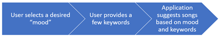

### CS 410 – Course Project Proposal – Fall 2021

Pericles Rocha (procha2@illinois.edu) – **team leader/coordinator**  
Gunther Correa Bacellar (gunther6@illinois.edu)

# “My Kind of Music”

## Motivation
Music is an important part of human culture. While it is often thought of as simple entertainment, it can also impact how an individual feels and affect their mood. In fact, music can even be used in therapy to help relieve pressure or certain feelings. Researchers have pondered the possible therapeutic and mood boosting benefits of music for centuries.

Specifically, researchers at Durham University and the University of Jyväskylä, Finland [^1]  discovered that even sad music can lift your mood, while other studies suggest music can boost happiness and reduce anxiety. From the drumbeats of our ancient ancestors to today’s unlimited streaming services, music is an integral part of the human experience. In some cases, users may seek to boost their current feeling, regardless of what that feeling is, and they seek for the right song to enhance what they are feeling. 

Our proposal is to build a recommendation system that will suggest songs to a user based on their desired mood and a few keywords. We will ask the user to provide what their desired mood is from a 1-5 scale (where 1 is “very sad” and 5 is “very happy”), a few key words, and suggest songs that match that sentiment and those keywords. This project falls into the “Free Topic” theme. 

## Method
We have obtained a database of song lyrics from a diverse set of music genres. Our application will determine the mood of each song using sentiment analysis on each of the song’s lyrics, and build a sentiment index. This sentiment will be a 1-5 scale, where 1 represents negative sentiment and 5 represents positive. Based on the sentiment index, we will use text retrieval techniques to find songs that match the terms provided by the user, within the songs that match the desired mood. Finally, we will provide suggested song names to the user, ordered by relevance, based on the content of the song lyrics.

 

Songs will be indexed for sentiment and key words based on their lyrics only. We will not analyze melodies or any audio content. This application will be limited to the English language. We will use Python as our programming language. 

## Milestones
The following are the steps and key milestones for this project: 

Task | Time needed | Completion data
---- | ----------- |----------------
Build the songs database with lyrics | 2 hours | Oct 30
Build the sentiment analysis algorithm and document indexes | 12 hours | Nov 8
Progress report | 2 hours | Nov 15
Build search engine to pick relevant song lyrics | 12 hours | Nov 22
Build user experience and app interface | 8 hours | Nov 29
Software code submission with documentation | 8 hours | Dec 9

## Evaluation
We will use roughly 3000 song lyrics for this project. Each song has its own characteristic in terms of what mood they convey in their lyrics. This is highly abstract and requires manual labor for testing and validation, so we will manually perform and document 300 tests (10% of the sample) to ensure the sentiment predicted by the algorithm is close enough to what the song lyrics are saying. 

Having tested and adjusted sentiment analysis, we will verify the relevance of the search engine using user queries and determine if the results are relevant or not. We will fine tune our algorithm until the index is optimal and provides relevant documents (in this case, song lyrics). 

[^1]:Research reveals pain and pleasure of sad music - Durham University (https://www.dur.ac.uk/news/newsitem/?itemno=28329)